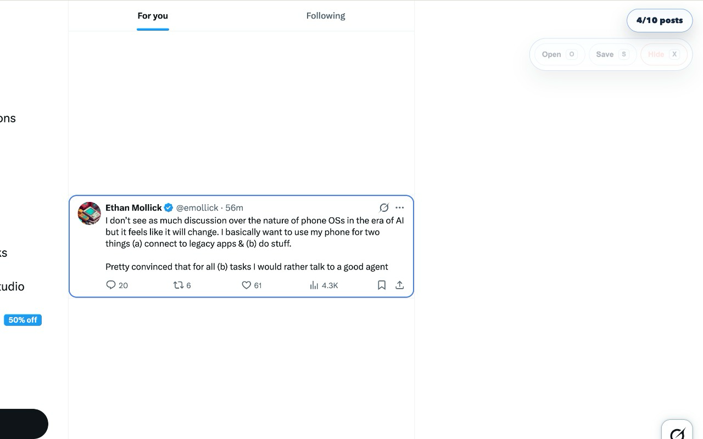
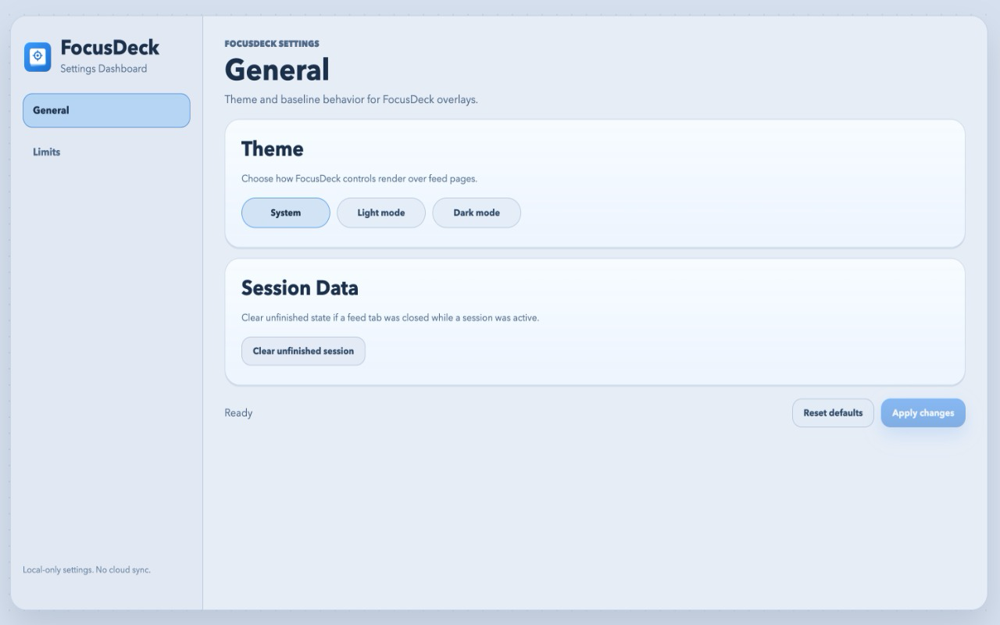
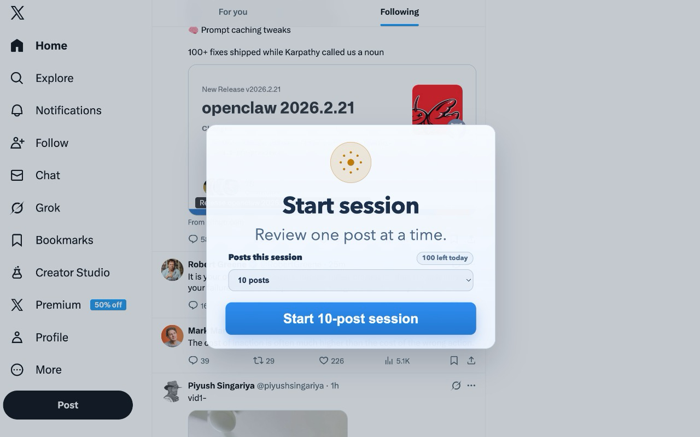
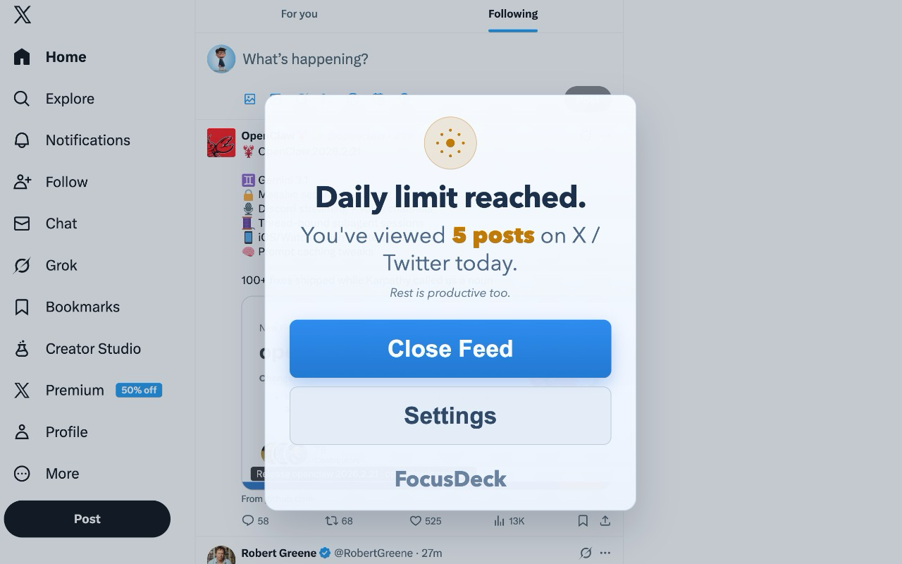

<p align="center">
  
</p>

# FocusDeck: Intentional Feed

FocusDeck is a WebExtensions MV3 extension for X.com that makes feed browsing intentional.

## Install FocusDeck

[](https://addons.mozilla.org/en-US/firefox/addon/focusdeck-intentional-feed/)
[](https://chromewebstore.google.com/detail/focusdeck-intentional-fee/pnfjneofemgjgapbomggpgpkedocpibp?hl=en)

## Extension Behavior

- Native X post UI is preserved (no custom post cards/decks).
- Feed access is session-gated; if no session is active, feed posts are hidden and a start-session popover is shown.
- During a session, only the focused post is visible; all other feed items are hidden.
- Promoted/ad units are hidden across supported X/Twitter routes (including idle or site-disabled states).
- Right sidebar modules are hidden while feed focus UI is active on feed routes.
- On fresh session start, focus begins at the first visible feed post; ongoing viewport changes can move focus to the nearest visible post.
- Floating action pill includes `Open`, `Save`, and `Hide`.
- After a posts-limit session ends, only previously viewed posts remain explorable; non-viewed posts are blocked, blurred, and non-clickable while general feed-side UI remains visible.

## Screenshots

<p align="center">
  
  
</p>
<p align="center">
  
  
</p>

## Session and Route Handling

- Session start supports by-post limits (`10 / 20 / 30 / custom`).
- When total daily post limit is enabled, session post limit selection is capped by remaining posts for the day.
- Opening post details/thread/media pauses session automatically.
- Returning to feed resumes automatically and restores focus when possible.
- Leaving feed routes pauses session quietly.
- Posts-limit completion switches to viewed-only explore mode on the current feed while keeping feed-side UI visible.
- Daily limit reached shows a dedicated modal with `Close Feed` and `Settings` (`Close Feed` closes the active tab).
- Start-session and daily-limit blocking modals lock page scrolling until dismissed.

## Settings (Current)

Clicking the extension icon opens Settings directly (no popup).

Available settings:
- Theme: `System`, `Light mode`, `Dark mode`
- Total daily post limit (global, local-only, resets at local browser midnight)
- Session maintenance actions: clear unfinished session, reset today's usage

## Safety and Policy Guardrails

- `Open`, `Save`, and `Hide` only run from explicit user gestures.
- `Save` and `Hide` actions are rate-limited (minimum 1 second between actions).
- No background automation, no bulk actions.
- No remote code loading.
- Core behavior does not require extension-owned network calls.
- Usage tracking is local-only (`storage.local`).

## Platform and Scope

- Primary: Chrome MV3
- Supported build target: Firefox (same codebase)
- Current content-script scope: `x.com` and `twitter.com` routes

Note: Adapter skeletons for HN/Reddit/LinkedIn are in-repo for future expansion, but the current version is X-focused.

## Tech Stack

- TypeScript
- Vite build pipeline
- `webextension-polyfill`
- Minimal dependencies

## Quick Start

1. Install dependencies:

```bash
npm install
```

2. Build bundles:

```bash
npm run build:chrome
npm run build:firefox
```

3. Load unpacked extension:
- Chrome: `chrome://extensions` -> Enable Developer Mode -> Load unpacked -> select `dist/chrome`
- Firefox: `about:debugging#/runtime/this-firefox` -> Load Temporary Add-on -> select `dist/firefox/manifest.json`

## Keyboard Shortcuts

- `J` / `ArrowDown`: next focused post
- `K` / `ArrowUp`: previous focused post
- `O`: open focused post in background tab (fallback: new tab)
- `S`: save/bookmark
- `X`: not interested

## Manual Test Checklist

- Feed is locked when no session is active.
- Start-session popover appears on X feed routes.
- Promoted/ad units stay hidden across X/Twitter routes, including when no session is running.
- Only one focused post is visible during active session.
- Right sidebar modules are hidden on feed routes while feed focus UI is active.
- Start-session and daily-limit modals block wheel/touch/key scrolling until dismissed.
- Post counter increments only for feed progression (not detail/reply scrolling).
- Opening details pauses session and returning to feed resumes automatically.
- `Open` action pill button and `O` shortcut open the focused post in a background/new tab.
- Posts-limit completion keeps feed-side UI visible while only previously viewed posts remain explorable; blocked posts remain non-clickable.
- Daily limit modal shows expected actions and `Close Feed` closes the active tab.
- Extension icon opens Settings page directly.
- Chrome and Firefox unpacked builds load successfully.

## Documentation

- Architecture: `/docs/architecture.md`
- Privacy policy: `/docs/privacy-policy.md`

## Verification Commands

- `npm run typecheck`
- `npm run test`
- `npm run build`
- `npm run release && npm run pack` (writes versioned ZIPs to `release/`)

## Firefox Reviewer Build Instructions

Use this section for AMO source-code submission.

### Operating System / Build Environment

- macOS or Linux
- Node.js `22.x`
- npm `10+` (or npm bundled with Node 22)

### Install Requirements

```bash
node -v
npm -v
```

If needed, install Node.js from `https://nodejs.org/`.

### Reproducible Firefox Build Steps

```bash
npm ci
npm run release:firefox
```

### Build Script Used

- `release:firefox` -> `RELEASE=1 npm run build:firefox`
- `build:firefox` -> `tsx scripts/build.ts firefox`

### Expected Outputs

- `dist/firefox/manifest.json`
- `dist/firefox/content.js`
- `release/focusdeck-firefox-v0.2.2.zip` (if `npm run pack:firefox` is executed)

### Source Integrity

- Source files in this repository are human-readable (`.ts`, `.html`, `.css`).
- Generated/minified files are produced only during the build step into `dist/`.
