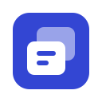
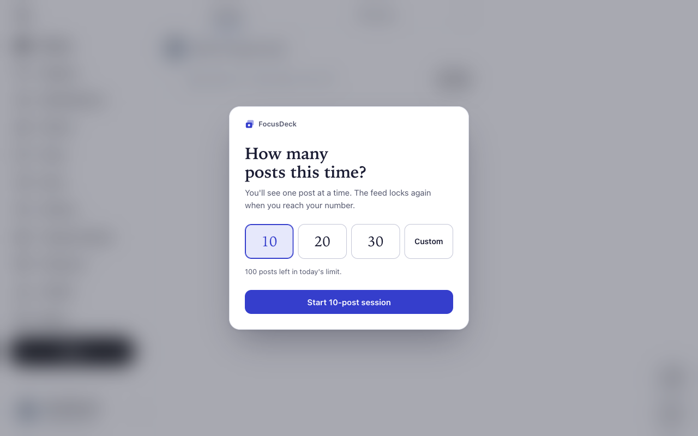
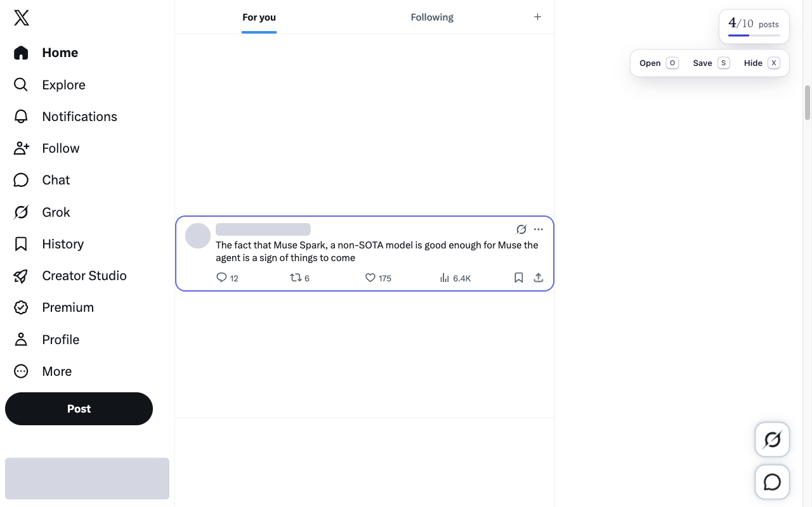
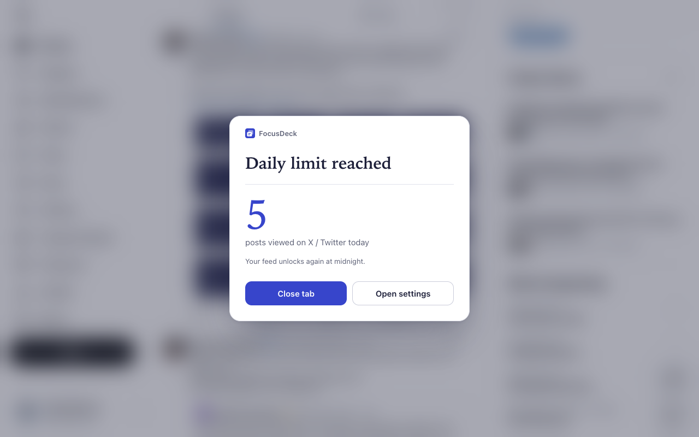
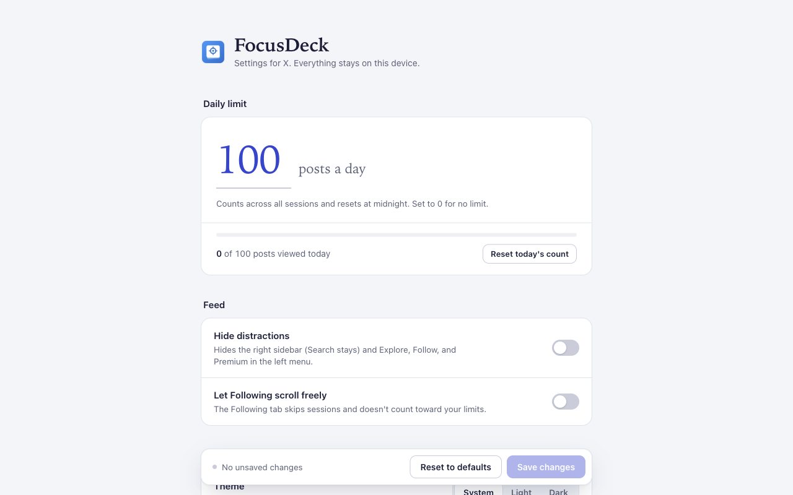

<p align="center">
  
</p>

# FocusDeck: Intentional Feed

See your X feed one post at a time. Choose how many posts you want, read them, and the feed locks again.

[](https://addons.mozilla.org/en-US/firefox/addon/focusdeck-intentional-feed/)
[](https://chromewebstore.google.com/detail/focusdeck-intentional-fee/pnfjneofemgjgapbomggpgpkedocpibp?hl=en)

<p align="center">
  
  
</p>
<p align="center">
  
  
</p>

## How it works

- **Sessions.** On the home feed, FocusDeck asks how many posts you want: 10, 20, 30, or a custom number. The feed stays hidden until you start.
- **One post at a time.** Only the focused post is visible, in X's own post UI. Move with `J`/`K` or the arrow keys.
- **Session target.** When you reach your number, the session ends. Posts you've seen stay readable; the rest are locked.
- **Daily limit.** A cap across all sessions, 100 posts by default. It resets at local midnight; set it to 0 to turn it off.
- **Automatic pauses.** Opening a post, thread, or media pauses the session, and coming back resumes it. Reading replies doesn't count.
- **A quieter X.** Ads are always hidden. You can also hide the right sidebar (Search stays) and Explore, Follow, and Premium.
- **Following tab.** Optionally, let Following scroll freely without counting toward your limits.

Everything stays in your browser's local storage. No account, no network requests, no analytics.

## Keyboard shortcuts

| Key | Action |
| --- | --- |
| `J` / `↓` | Next post |
| `K` / `↑` | Previous post |
| `O` | Open the post in a background tab |
| `S` | Bookmark |
| `X` | Not interested |

Open, Save, and Hide run only when you press them. Save and Hide are limited to one per second.

## Settings

Click the toolbar icon to open Settings:

- Daily limit, with today's count and a reset
- Hide distractions
- Let Following scroll freely
- Theme: System, Light, or Dark
- Clear an unfinished session

## What's new

### 1.0.0

- Redesigned session prompt, daily-limit dialog, session counter, and Settings page, with light and dark themes.
- Session and daily-limit dialogs work from the keyboard and are announced to screen readers.
- Posts left behind after a session show a lighter locked state.
- Daily counts stay accurate across tabs, and open tabs pick up midnight resets and limit changes.
- Closed gaps that let unseen posts show without counting: video playback, resuming, recycled posts, and returning from Following.
- Sessions in one tab no longer resume, overwrite, or clear another open tab's session.
- Save no longer removes an existing bookmark.
- After FocusDeck updates, open X tabs go back to normal instead of staying locked until you reload them.

### 0.3.0

- Optional distraction filter for X's sidebar and left menu.
- Optional Following-tab bypass.
- More reliable `Open` for X article posts.

## Development

```bash
npm install
npm run build        # dist/chrome and dist/firefox
npm test
npm run typecheck
```

Load the unpacked build:

- **Chrome:** `chrome://extensions` → Developer mode → Load unpacked → `dist/chrome`
- **Firefox:** `about:debugging#/runtime/this-firefox` → Load Temporary Add-on → `dist/firefox/manifest.json`

`npm run release && npm run pack` writes the Chrome, Firefox, and source ZIPs to `release/`.

FocusDeck runs on `x.com` and `twitter.com`. Chrome MV3 is the primary target; Firefox builds from the same code. Adapter stubs for HN, Reddit, and LinkedIn are in the repo but not active.

Docs: [architecture](docs/architecture.md), [privacy policy](docs/privacy-policy.md).

### Manual test checklist

- The feed is hidden with no session, and the session prompt appears on the home feed.
- During a session, only the focused post shows; `J`/`K` move between posts.
- The counter goes up only when moving through the feed, not while reading a post or its replies.
- Opening a post pauses the session; going back resumes it on the same post.
- Reaching the target leaves seen posts readable and locks the rest.
- Reaching the daily limit shows the dialog; `Close tab` closes the tab.
- Both dialogs block page scrolling and work with Tab, Enter, and Space.
- Hide distractions and the Following bypass take effect after saving.
- Ads stay hidden on every X page, with or without a session.
- The toolbar icon opens Settings; Chrome and Firefox builds both load.

## Firefox reviewer build instructions

For AMO source review.

**Environment:** macOS or Linux, Node.js 22.x, npm 10+ (`node -v`, `npm -v`). Node is available from https://nodejs.org/.

**Build:**

```bash
npm ci
npm run release:firefox
```

`release:firefox` runs `RELEASE=1 npm run build:firefox`, which runs `tsx scripts/build.ts firefox`.

**Outputs:**

- `dist/firefox/manifest.json` and `dist/firefox/content.js`
- `release/focusdeck-firefox-v1.0.0.zip` with `npm run pack:firefox`
- `release/focusdeck-source-v1.0.0.zip` with `npm run pack:source` or `npm run pack`

All source is human-readable (`.ts`, `.html`, `.css`). Minified files are generated only in `dist/` during the build.
