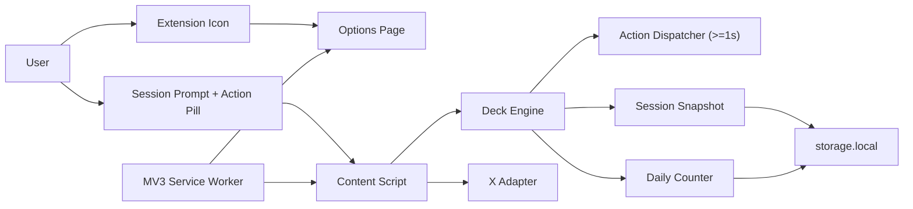
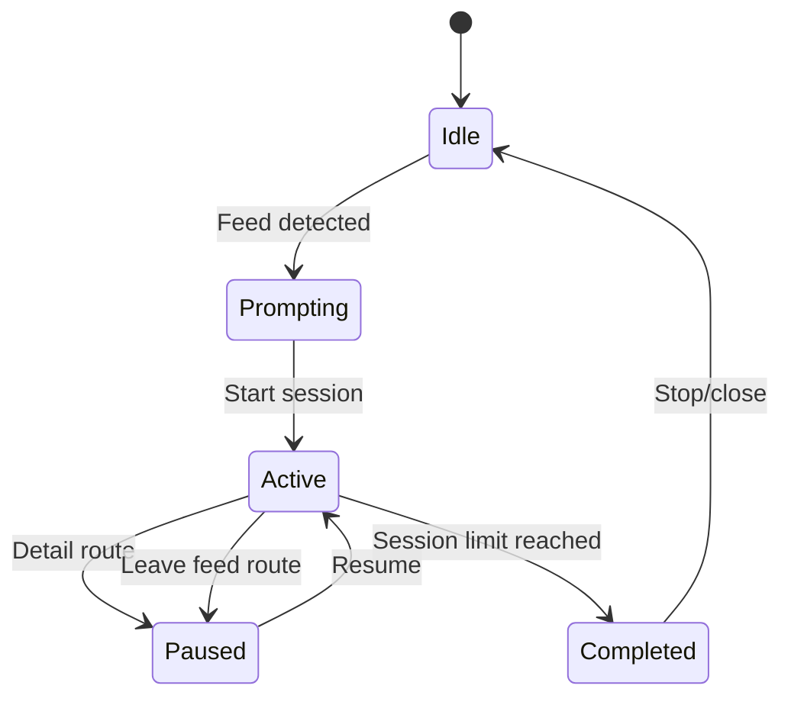

# FocusDeck Architecture (Current)

Last updated: 2026-02-15

`/Users/makeavish/FocusDeck/implementation_plan.md` is deprecated. The implementation plan now lives in this document under **Consolidated Implementation Plan**.

## Runtime Component Graph

## Session-Gated Feed Model

On supported feed routes (`x.com` / `twitter.com`):

- Without an active session, feed posts are locked (`data-focusdeck-locked`) and a session-start prompt is shown.
- With an active/paused session on feed, only the focused post remains visible (`data-focusdeck-focused`) while non-focused posts are hidden (`data-focusdeck-hidden`).
- Fresh sessions initialize focus to the first visible feed post; later viewport changes can re-select the nearest visible post.
- Sidebar and promoted/ad units are hidden on feed routes (`data-focusdeck-hidden-ui`).
- On detail/thread/media routes, session is paused (`pauseReason=details`) and detail/reply scrolling does not increment feed counters.
- After a posts-limit completion, FocusDeck enters viewed-only explore mode: viewed posts remain accessible and non-viewed posts are blocked/blurred.
- Action pill remains minimal (`Save`, `Not interested`); details opening is handled by native route interaction.

## State Machine

## Route Handling

Route transitions are detected with:

- `history.pushState` wrapper
- `history.replaceState` wrapper
- `popstate` listener

Policy:

- Feed -> Detail: pause session and suspend counters.
- Detail -> Feed: resume automatically and restore last focused post when possible.
- Feed -> Non-feed route: pause quietly.
- No session on feed: keep feed locked until a new session starts.
- Daily limit modal `Close Feed` action sends a message to service worker to close the active tab.

## Counting Rules

- Post views increment only when focus advances to a new progress key during active feed sessions.
- Reply/detail thread scrolling does not contribute.
- Thread progression is deduplicated so one thread counts as one.
- Total daily post limit is enforced with local-midnight reset.
- Session post-limit options are capped by remaining total daily posts when the daily cap is enabled.

## Action Safety Model

- `Not interested` and `Save` require explicit user gesture.
- Actions execute through centralized dispatcher with 1-second minimum interval.
- No background automation or bulk actions.
- Fallback assist mode is used when native selectors drift.

## Consolidated Implementation Plan

This section replaces the standalone `implementation_plan.md`.

### Product Contract

- Keep native X post UI; do not re-render cards.
- Gate feed access behind explicit session start.
- Keep only one focused post visible during active/paused feed sessions.
- Require explicit user gestures for native actions.
- Keep telemetry local-only.
- Keep action pill minimal (`Save`, `Not interested`), with details opening handled by native route interaction.

### Source Layout

- `src/content/index.ts`: runtime orchestration, route handling, feed lock/focus layer application
- `src/core/deck-engine.ts`: session state, focus progression, counting, limit checks
- `src/adapters/x-adapter.ts`: X-specific selectors and native action execution
- `src/content/overlay/*`: prompt, action pill, completion modal, daily limit modal
- `src/settings/*`: options UI (theme + total daily limit)
- `src/background/service-worker.ts`: storage/message API + toolbar -> options routing

### Build and Compatibility

- TypeScript + Vite multi-build
- Chrome target: `dist/chrome`
- Firefox target: `dist/firefox`
- Promise-based `browser.*` via `webextension-polyfill`

### Cleanup Status

- Toolbar click opens settings page directly.
- Docs are aligned with shipped behavior and deprecated-option removals.
- Codebase should stay free of unused constants/modules.
- Session-start reliability on slow-loading feed routes is maintained by retry/lazy-load handling.

### Next Steps

1. Add integration smoke tests around route transitions and counting guards.
2. Add settings E2E checks for theme and total daily limit persistence.
3. When enabling non-X adapters, expand manifest host permissions and add per-site QA.
