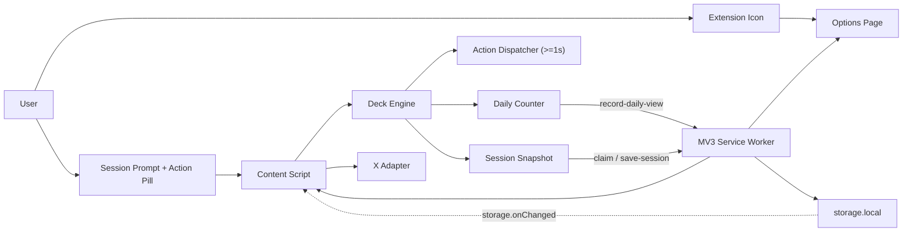
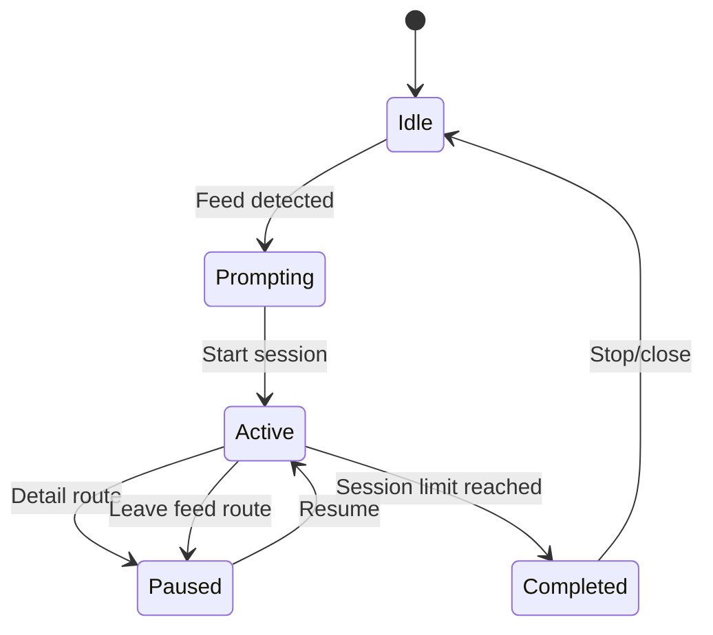

# FocusDeck Architecture (Current)

Last updated: 2026-10-02

`/Users/makeavish/FocusDeck/implementation_plan.md` is deprecated. The implementation plan now lives in this document under **Consolidated Implementation Plan**.

## Runtime Component Graph

```mermaid
flowchart LR
    User["User"] --> Toolbar["Extension Icon"]
    Toolbar --> Settings["Options Page"]
    User --> Overlay["Session Prompt + Action Pill"]
    Overlay --> CS["Content Script"]
    BG["MV3 Service Worker"] --> Settings
    BG --> CS
    CS --> Engine["Deck Engine"]
    CS --> XAdapter["X Adapter"]
    Engine --> Dispatcher["Action Dispatcher (>=1s)"]
    Engine --> Daily["Daily Counter"]
    Engine --> Snapshot["Session Snapshot"]
    Daily -->|record-daily-view| BG
    Snapshot -->|claim / save-session| BG
    BG --> LocalStore["storage.local"]
    LocalStore -.->|storage.onChanged| CS
```

## Session-Gated Feed Model

On supported routes (`x.com` / `twitter.com`):

- Without an active session, feed posts are locked (`data-focusdeck-locked`) and a session-start prompt is shown.
- With an active/paused session on feed, only the focused post remains visible (`data-focusdeck-focused`) while non-focused posts are hidden (`data-focusdeck-hidden`).
- If the site setting `bypassFollowingFeed` is enabled and X's selected home tab is `Following`, FocusDeck steps aside: feed locking, post-limit blocking, and daily-limit UI are suppressed until the user returns to a managed feed tab.
- Fresh sessions initialize focus to the first visible feed post; later viewport changes can re-select the nearest visible post.
- Promoted/ad units are hidden across supported X/Twitter routes (`data-focusdeck-ad-hidden`), including idle and site-disabled states.
- If `hideDistractingElements` is enabled, FocusDeck hides non-essential X/Twitter chrome across supported routes while preserving the right-rail Search entry point.
- During active/paused feed sessions, sidebar modules are hidden on feed routes (`data-focusdeck-hidden-ui`).
- On detail/thread/media routes, session is paused (`pauseReason=details`) and detail/reply scrolling does not increment feed counters.
- After a posts-limit completion, FocusDeck enters viewed-only explore mode: viewed posts remain accessible and non-viewed posts are blocked/blurred.
- In viewed-only explore mode, auxiliary feed-side UI remains visible while blocked posts stay non-interactive.
- Action pill remains minimal (`Open`, `Save`, `Hide`).

## State Machine

```mermaid
stateDiagram-v2
    [*] --> Idle
    Idle --> Prompting: Feed detected
    Prompting --> Active: Start session
    Active --> Paused: Detail route
    Active --> Paused: Leave feed route
    Paused --> Active: Resume
    Active --> Completed: Session limit reached
    Completed --> Idle: Stop/close
```

## Route Handling

Route transitions are detected with:

- `history.pushState` wrapper
- `history.replaceState` wrapper
- `popstate` listener
- interval fallback watcher (220ms) for route changes that bypass history hooks

Policy:

- Feed -> Detail: pause session and suspend counters.
- Feed (`For you`) -> Feed (`Following` with bypass enabled): pause active session as `followingBypass` and remove blocking UI.
- Feed (`Following` with bypass enabled) -> Feed (`For you`): restore the paused session or re-show the daily-limit modal, depending on prior state.
- Detail -> Feed: resume automatically and restore last focused post when possible.
- Feed -> Non-feed route: pause quietly and dismiss blocking modals (scroll lock is released).
- No session on feed: keep feed locked until a new session starts.
- Start-session and daily-limit modals are blocking and lock page scroll while visible.
- Daily limit modal `Close tab` action sends a message to service worker to close the active tab.
- `Open` action sends `focusdeck:open-background-tab`; service worker opens an inactive tab (same window when available).

## Counting Rules

- Post views increment only when focus advances to a new progress key during active feed sessions.
- Reply/detail thread scrolling does not contribute.
- Repeated cards with the same canonical status ID count once per session. Different status IDs in a thread count separately; no reliable shared root is derived from feed markup.
- Total daily post limit is enforced with local-midnight reset.
- Session post-limit options are capped by remaining total daily posts when the daily cap is enabled.

## Cross-Tab State

- Daily usage is owned by the service worker. Tabs reserve views, then atomically commit usage and session progress by session ID and progress key before exposure. Cancelled requests release reservations or undo unapplied commits; unacknowledged commits remain presentable on recovery even at the cap, and are acknowledged after showing without another charge. The recovered post remains readable while new progress stays blocked; leaving or stopping ends this presentation exception.
- Tabs watch `storage.onChanged` for usage and limit changes, so Settings edits, usage resets, and other tabs' views apply immediately. Tabs also refresh at local midnight and on activation.
- Durable snapshots live in `focusdeck:session-snapshots`, keyed by session ID. Tab leases and document owner tokens live in `storage.session`, so browser restarts cannot reuse numeric tab ownership. Loading provisionally suspends ownership; surviving documents reclaim only their unadopted session before progressing. Discard or document replacement revokes ownership without deleting progress. Uncommitted reservations expire after 30 seconds; current requests retry once with a fresh reservation. A tab can only save or clear its leased session.
- A new feed tab claims a snapshot only when its original document no longer owns it, so closing a tab mid-session still resumes in the next one. After a browser restart, unleased snapshots remain recoverable. Legacy migration writes the destination and marker before removing the old key.

### Known limitations

- At the daily cap, a post that was charged but not yet shown when its tab closed is recovered only if it's in the first feed scan; one that loads later stays hidden.
- If several charged posts are waiting to be shown at the cap, recovery shows only the first.

## Action Safety Model

- `Open`, `Save`, and `Hide` require explicit user gesture.
- `Save` and `Hide` execute through centralized dispatcher with 1-second minimum interval.
- No background automation or bulk actions.
- Fallback assist mode is used when native selectors drift.

## Consolidated Implementation Plan

This section replaces the standalone `implementation_plan.md`.

### Product Contract

- Keep native X post UI; do not re-render cards.
- Gate feed access behind explicit session start.
- Keep only one focused post visible during active/paused feed sessions.
- Require explicit user gestures for native actions.
- Keep telemetry local-only.
- Keep action pill minimal (`Open`, `Save`, `Hide`).

### Source Layout

- `src/content/index.ts`: runtime orchestration, route handling, feed lock/focus layer application
- `src/core/deck-engine.ts`: session state, focus progression, counting, limit checks
- `src/adapters/x-adapter.ts`: X-specific selectors and native action execution
- `src/adapters/x-dom.ts`: shared X card selectors, ad detection, and feed-mutation filtering
- `src/content/overlay/*`: prompt, top-dock action pill, daily limit modal
- `src/settings/*`: options UI (theme, distraction filter, total daily limit, Following bypass)
- `src/content/following-bypass.ts`: Following-tab detection and bypass policy helpers
- `src/background/service-worker.ts`: storage/message API, daily-usage writes, toolbar -> options routing, background-tab open/close actions
- `src/background/session-store.ts`: per-tab session snapshot ownership and closed-tab recovery
- `src/shared/runtime-state.ts`: content-script client for worker-owned daily usage and session snapshots

### Build and Compatibility

- TypeScript + Vite multi-build
- Chrome target: `dist/chrome`
- Firefox target: `dist/firefox`
- `npm run pack` produces Chrome, Firefox, and source release ZIPs in `release/`
- Promise-based `browser.*` via `webextension-polyfill`

### Cleanup Status

- Toolbar click opens settings page directly.
- Docs are aligned with shipped behavior and deprecated-option removals.
- Codebase should stay free of unused constants/modules.
- Session-start reliability on slow-loading feed routes is maintained by retry/lazy-load handling.

### Next Steps

1. Add integration smoke tests around route transitions and counting guards.
2. Add settings E2E checks for theme and total daily limit persistence.
3. When enabling non-X adapters, expand manifest host permissions and add per-site QA.
